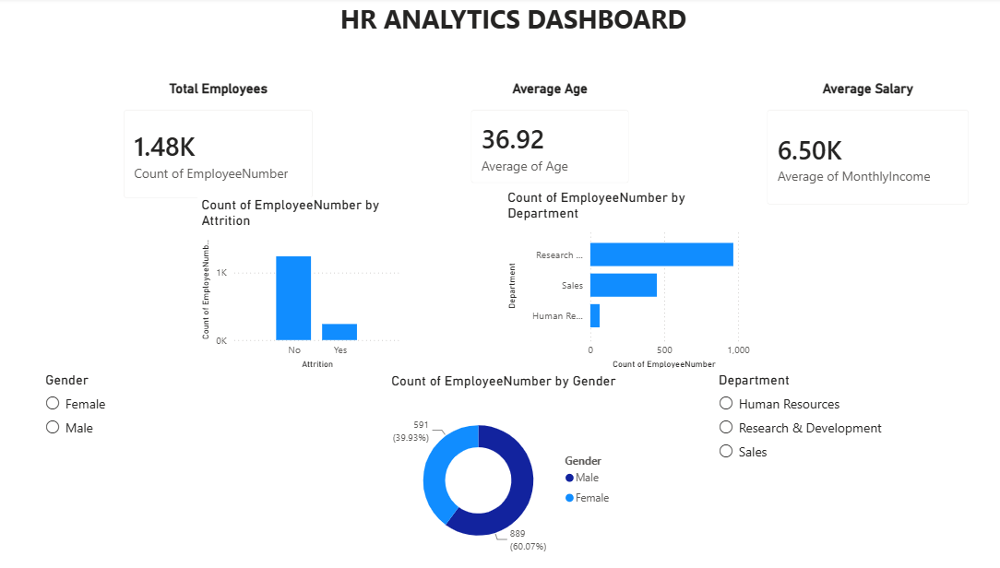

# HR Analytics Dashboard

## Project Overview

This project presents an interactive HR Analytics Dashboard built using Power BI to analyze employee attrition, workforce demographics, salary trends, and department-wise employee distribution. The dashboard helps HR teams make data-driven decisions by providing key workforce insights through interactive visualizations and filters.

---

## Tools Used

- Power BI
- Excel / CSV Dataset
- DAX
- Data Visualization

---

## Key Performance Indicators (KPIs)

- Total Employees
- Average Age
- Average Salary

---

## Dashboard Features

### Employee Attrition Analysis
- Analyze employees who left the organization versus those who stayed.

### Department-wise Analysis
- Compare workforce distribution across departments:
  - Research & Development
  - Sales
  - Human Resources

### Gender Distribution
- Visualize employee distribution by gender.

### Interactive Filters
- Department Filter
- Gender Filter

---

## Business Insights

- Research & Development has the highest employee count.
- Workforce demographics can be analyzed by gender and department.
- Attrition trends help identify employee retention patterns.
- HR teams can use these insights to support workforce planning and decision-making.

---

## Dashboard Preview



---

## Project Structure

```text
HR-Analytics-Dashboard
│
├── dashboard
│   └── HR_Analytics_Dashboard.pbix
│
├── screenshots
│   └── dashboard.png
│
└── README.md
```

---

## Skills Demonstrated

- Data Analysis
- Dashboard Design
- KPI Development
- Data Visualization
- Business Intelligence
- HR Analytics
- Power BI Reporting

---

## Author

Harsh Raj

Aspiring Data Analyst | SQL | Power BI | Python